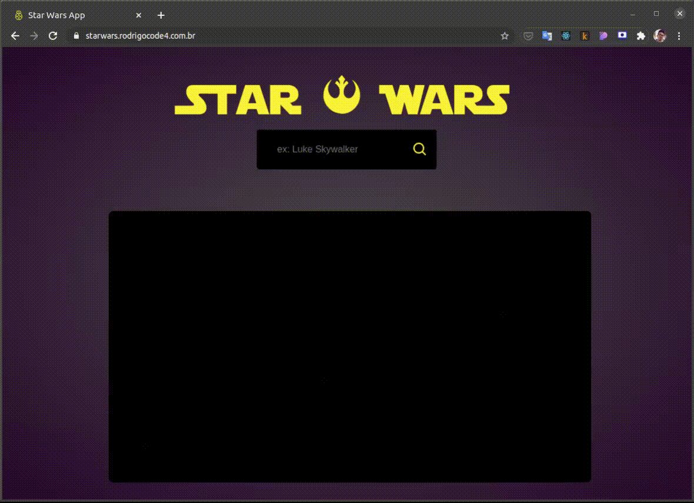

# Star Wars - Web App
Web App para buscar pesonagens de Star Wars e informações relacionadas ao mesmo.
<div style="display: flex; justify-content: center;">
  <a href="http://starwars.rodrigocode4.com.br/">
    
  </a>
</div>

## Este projeto usa as seguintes tecnologias:

- [React](https://pt-br.reactjs.org/)
- [Yarn](https://yarnpkg.com/)
- [CRA](https://create-react-app.dev/)
- [Typescript](https://www.typescriptlang.org/pt/)
- [Jest](https://jestjs.io/pt-BR/)
- [styled-components](https://styled-components.com/)
- [styled-media-query](https://www.npmjs.com/package/styled-media-query)
- [Styled Icons](https://styled-icons.js.org/)
- [ESLint](https://eslint.org/)
- [EditorConfig](https://editorconfig.org/)
- [Prettier](https://prettier.io/)


## Comandos para o Terminal - CLI
---
### `Instalar dependências:`
Neste tutorial utilizaremos o *Yarn*, mas poderá também ser utilizado com *NPM*, consulte a [documentação](https://docs.npmjs.com/cli/v7/commands/npm):

```bash
yarn install
```

### `Rodar aplicação em modo desenvolvimento:`
```bash
yarn start
```
Digite [http://localhost:3000](http://localhost:3000) no seu navegador para ver o resultado.

### `Rodar os testes da aplicação:`
```bash
yarn test
```

### `Rodar o build da aplicação:`
```bash
yarn build
```
Compila o aplicativo para produção na pasta `build`. \
Ele agrupa corretamente o React no modo de produção e otimiza a construção para o melhor desempenho.
> Que a força esteja com você. 🖖
